# SourceFlow

English | [中文](README.md)

Why is the water so clear? Because fresh water keeps flowing from its source.  
Hence the name: **SourceFlow**

SourceFlow is a local-first intelligent note-taking and knowledge workspace. It keeps the mature note experience of block editing, bidirectional links, and Markdown WYSIWYG, while bringing AI actions, source-based writing, sync protection, web capture, and an extension ecosystem directly into everyday writing workflows.

SourceFlow is built for long-term writing, source organization, knowledge accumulation, and AI-assisted creation inside a workspace you can keep under your own control.

- Repository: [lonelyor/SourceFlow](https://github.com/lonelyor/SourceFlow)
- License: `AGPLv3`
- Compliance note: see [NOTICE.md](NOTICE.md)

## Why SourceFlow

- It does not hide AI inside a separate chat window. AI works directly on the note you are writing, the text you selected, and the materials you just imported.
- It stays local-first and workspace-oriented, so your data, attachments, sync folders, recovery paths, and migration flow remain explicit.
- It is not only about text. Web pages, PDFs, images, code, and attachments can all enter the same organization pipeline.
- It allows extensions, but with clearer boundaries: plugin source, summary, integrity checks, and permission review are surfaced earlier.

## UI Preview

### Editor and note workspace


Block editing, bidirectional links, breadcrumbs, sidebars, and multi-tab workflows can all work together in the same workspace, which fits long-term writing, project organization, and knowledge accumulation.

### Note organization and block editing

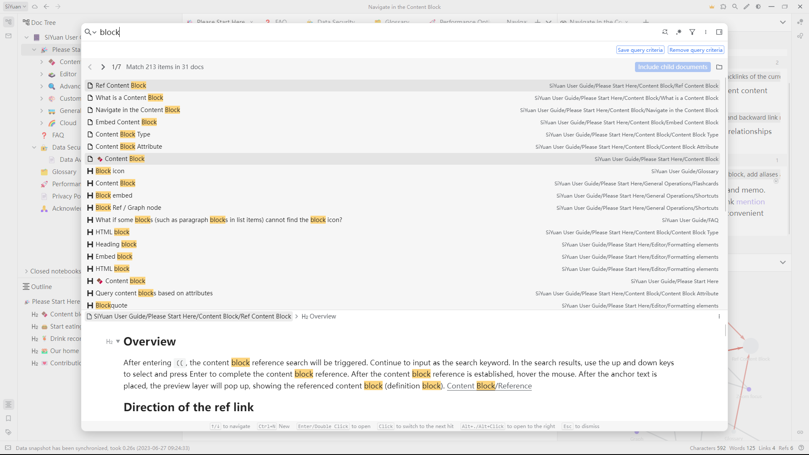

SourceFlow still puts “easy to write” and “easy to organize” first, instead of interrupting note-taking with overly complex flows.

### AI generation and result flow

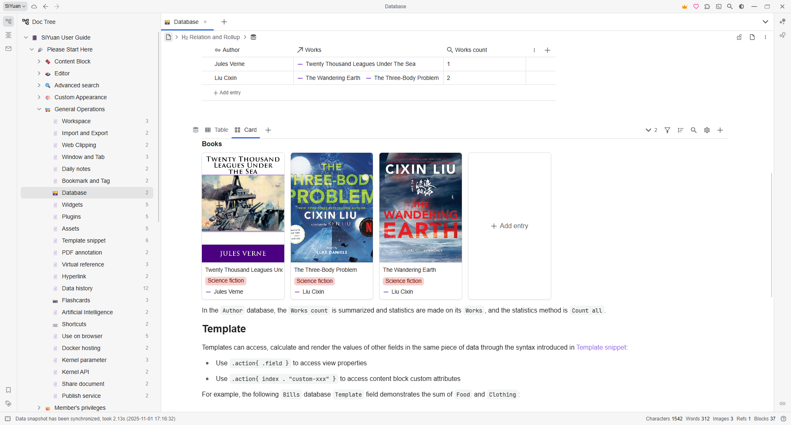

AI output does not stay trapped in an isolated chat box. It can continue flowing into the results sidebar and then into formal notes for selection, rewriting, and archiving.

More screenshots will continue to be added over time.

## New Features

> Custom startup background  
> If you want your own “game launch” style startup moment, this can do it.

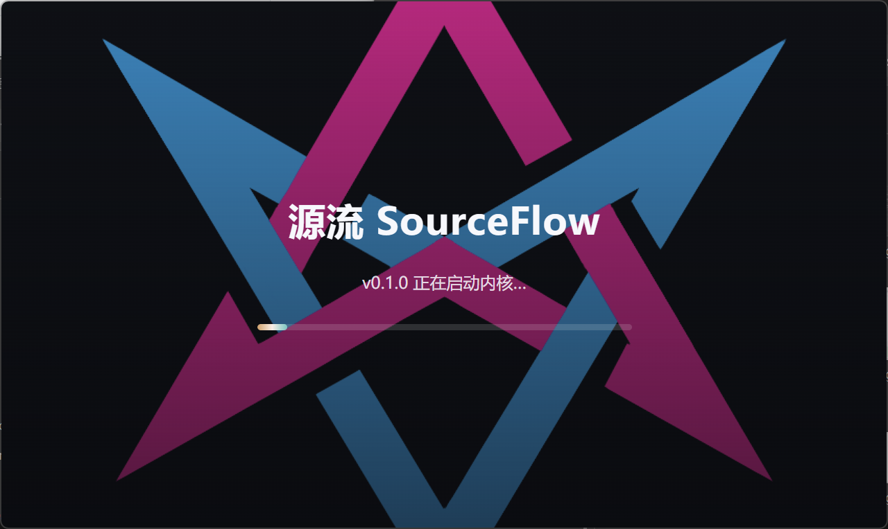

> Custom homepage  
> You can write it in Markdown and set it as the homepage from the context menu, or build a standalone HTML page and use that as the homepage. A browser-style dashboard works especially well here. Of course, the homepage can also just be a beautiful image.

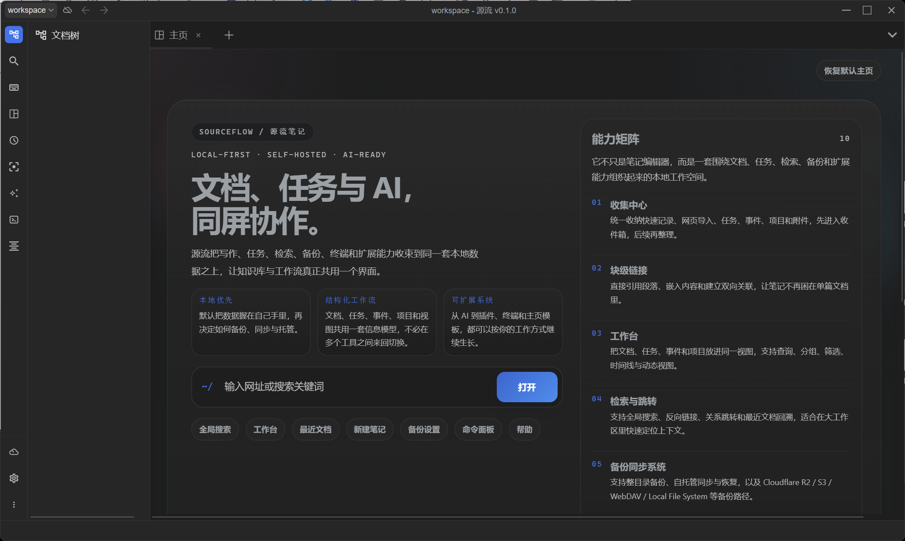

> AI action menu  
> After selecting text, you can directly run summary, outline, polish, continuation, Q&A, and review-card actions from the context menu.

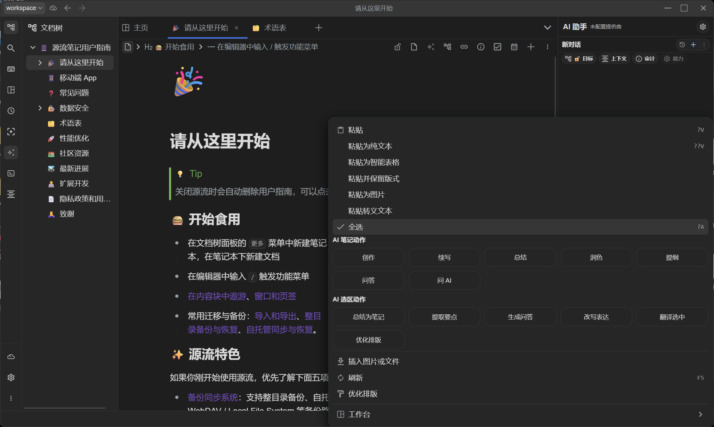

> AI assistant and results sidebar  
> This shows image upload, screenshot paste, iterative prompts, and how generated output flows back into the results sidebar.

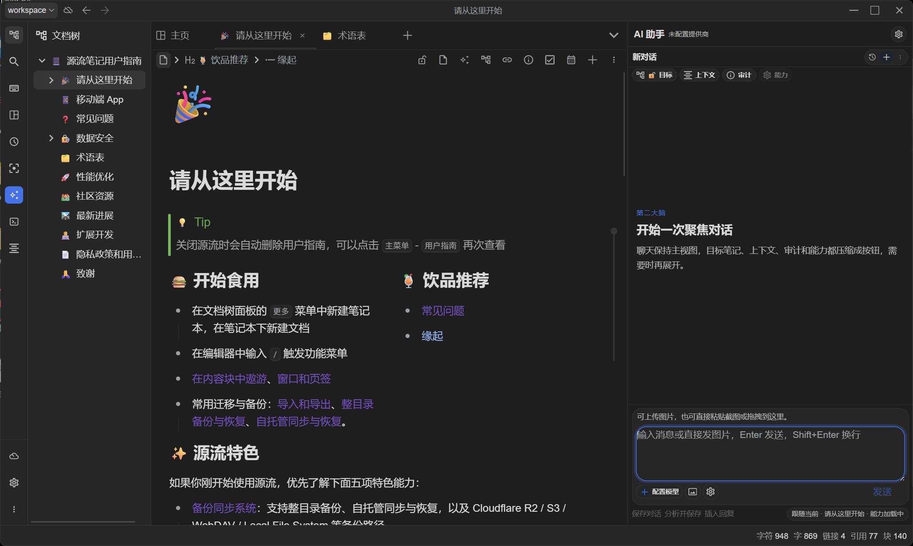

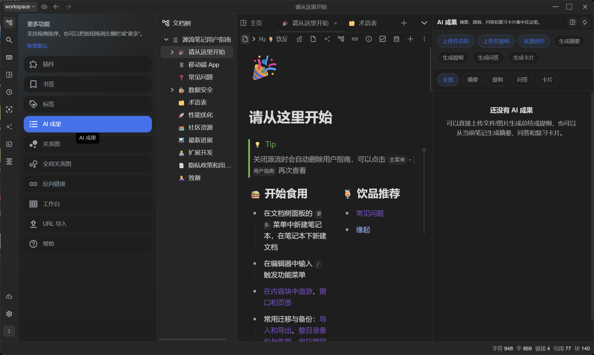

> Source-based writing workspace  
> This shows a workspace built around organizing, analyzing, and writing from web pages, PDFs, images, code, and other source materials.

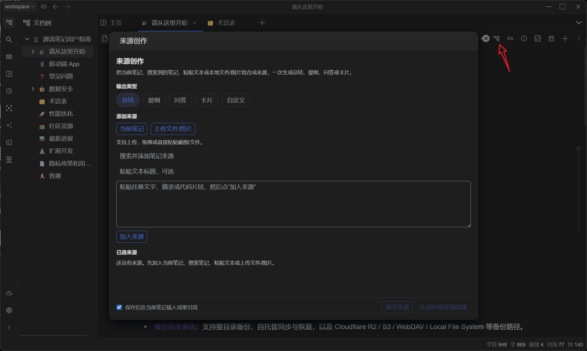

> URL import and asset localization (web snapshot)  
> This shows a public web page imported into Markdown with images and attachments localized.

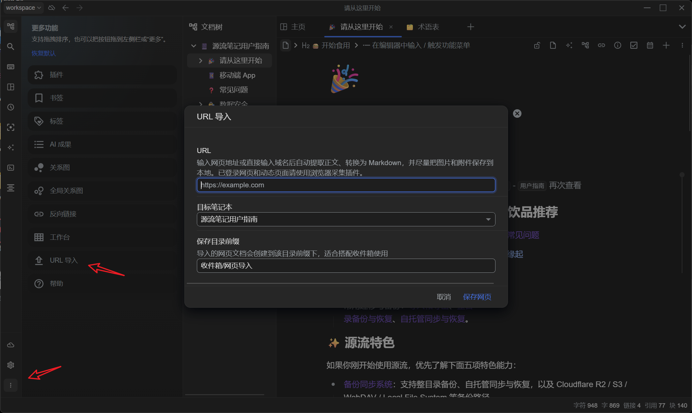

> Browser capture extension  
> This shows the extension popup, logged-in page capture, and the saved result inside SourceFlow. You still need to enable Developer Mode and load the extension yourself.

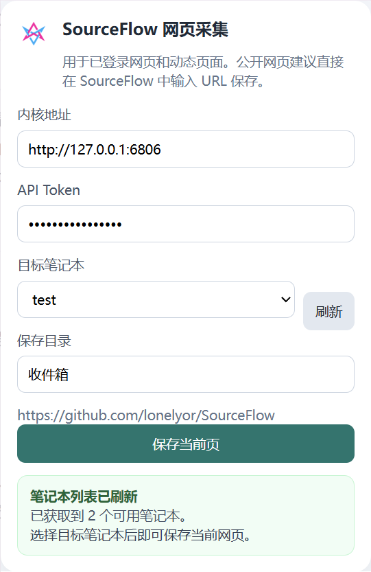

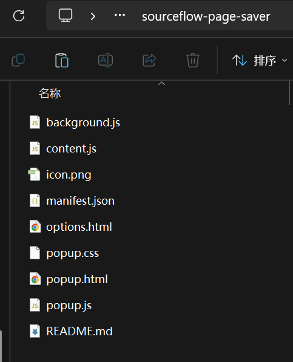

> Local file system sync setup  
> This shows `Settings -> Sync and Restore Backup` with the `Local File System` provider, `Endpoint`, `Remote backup directory`, and the enable switch.

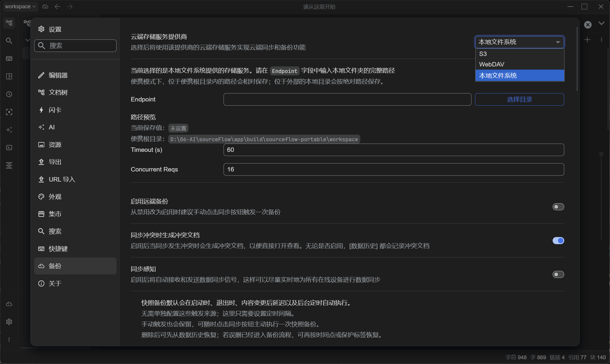

> Sync diagnostics and restore  
> This shows sync diagnostics, conflict documents, data history, and point-in-time recovery entry points.

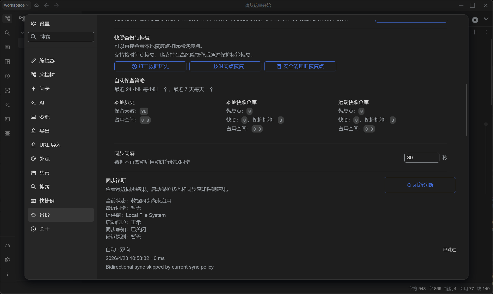

> Bazaar and permission confirmation  
> This shows the Bazaar installation flow with source, `SHA-256`, and permission declaration confirmation before enabling a plugin.

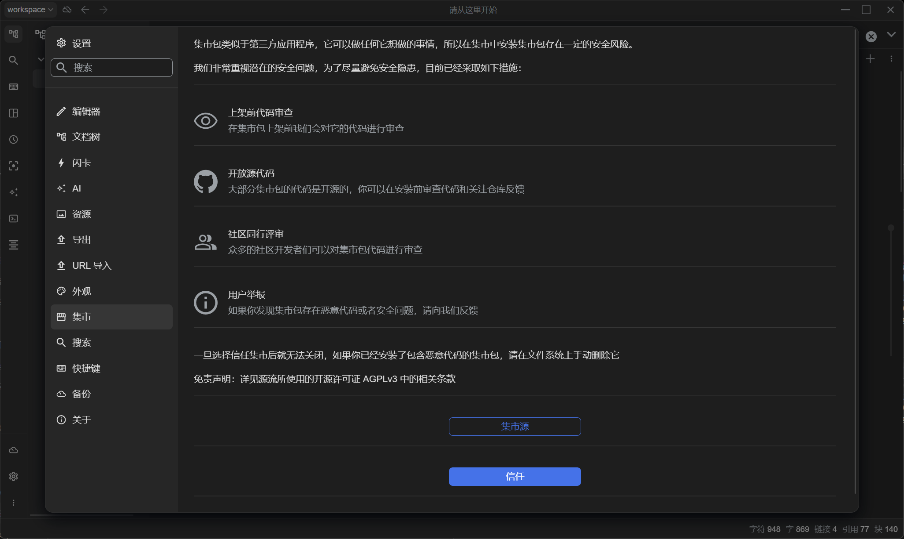

> Appearance customization  
> Supports startup backgrounds, note backgrounds, cursors, desktop mascots, and more, with custom images.

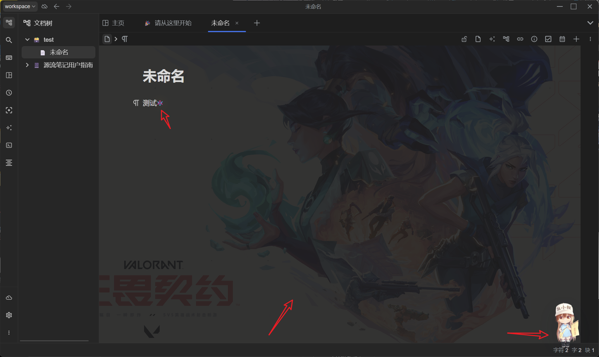

## Feature Highlights

### 1. A note workspace designed around writing and organizing

- Core capabilities such as block editing, bidirectional links, breadcrumbs, tabs, split views, and context menus are all preserved for long-term content organization.
- The editor keeps a direct Markdown WYSIWYG workflow, so you do not have to switch back and forth between source mode and preview mode just to write.
- It fits knowledge bases, research notes, project documents, personal archives, and everyday information capture.
- Traditional note capabilities such as PDF workflows, flashcards, themes, and export are still there and are not replaced by AI workflows.

### 2. AI that works directly on notes instead of living in chat

- You can run summary, outline, polish, continuation, Q&A, and review-card actions directly after selecting text, without copying content into another tool.
- The AI assistant supports image upload, drag and drop, and pasted screenshots, which works well when reading source materials while asking questions.
- AI output flows into the results sidebar, making it easy to keep, compare, refine, and insert it back into formal notes.
- The goal is “select and use, generate and keep moving”, not introducing another heavy interface to learn.

### 3. Web pages, PDFs, images, and code can all enter the same source pipeline

- Public pages can be imported by URL and converted into Markdown with localized images and attachments whenever possible.
- Logged-in pages, dynamic pages, and pages that depend on a live browser context can be captured with the browser extension.
- Source-based writing can revolve around text, code, PDFs, images, and other source materials in one workspace.
- OCR, PDF handling, attachment archiving, and source descriptions help turn “materials” into “something you can keep writing from”.

### 4. Sync and recovery are more cautious, and the workspace is safer

- SourceFlow supports `Local file system`, `S3`, and `WebDAV` as sync providers, and `Local file system` is the default provider rather than just a cloud fallback.
- It is much closer to “observable snapshot backup and restore” than to silent black-box sync.
- Startup protection, continue-offline behavior, sync diagnostics, conflict documents, data history, and point-in-time restore are all part of one flow.
- Workspace paths, sync directories, data repo keys, and recovery profile files stay explicit, which is better for people who care about long-term data ownership.

### 5. Extensible, but with boundaries by default

- SourceFlow includes its own Bazaar workflow for plugins, themes, and related extensions.
- Before installation and activation, plugins can expose source, summary, `SHA-256`, and declared permissions for review.
- Installed plugins stay disabled by default until you explicitly enable them.
- High-risk capabilities such as workspace read/write, network access, and host control are surfaced through a permission model rather than hidden behind vague trust.

### 6. Not limited to one machine

- Desktop, mobile, and Docker usage are all part of the product direction, so it can fit personal, multi-device, and self-hosted setups.
- The browser capture extension helps pull web content back into the workspace instead of leaving important materials scattered across browser tabs.
- Windows portable builds, desktop releases, and sync-oriented release workflows are already part of the release pipeline.

## Browser Capture Extension

SourceFlow includes a separately distributed browser capture extension: `SourceFlow Page Saver`.

- For public pages, the preferred path is still SourceFlow's built-in `URL Import`.
- For logged-in pages, dynamic pages, member-only pages, or pages that must rely on the live browser context, use the extension to save the current tab.
- The extension only reads the content that is already open in your browser. Markdown conversion, asset localization, and note creation are still handled by the SourceFlow kernel.
- The result is `Markdown + local assets`. The goal is “something you can continue organizing and writing from”, not pixel-perfect browser archiving and not `MHTML`.

### Install from Releases

Each GitHub Release includes a browser extension archive: `sourceflow-page-saver-<version>.zip`.

1. Download the zip from Releases and extract it.
2. Open the extension management page in Chrome or Edge.
3. Enable Developer Mode.
4. Choose "Load unpacked".
5. Select the extracted `sourceflow-page-saver` directory.

For local debugging, you can also load the source directory directly: [browser-extension/sourceflow-web-clipper](browser-extension/sourceflow-web-clipper).

## Sync and Restore Backup

SourceFlow currently supports `Local file system`, `S3`, and `WebDAV` as sync providers. For most self-hosted users, I still recommend starting with `Local file system` because it is the most direct and the easiest to troubleshoot. It also fits local backup folders, external SSDs, removable drives, mounted NAS paths, or mapped network drives that already appear to the OS as local directories.

### Understand these three concepts first

- The `workspace` is the local directory you edit every day.
- The `sync target` is the directory or service used to store encrypted snapshot backups, and it should not be the workspace itself.
- Even when you choose `Local file system`, the UI still shows a field called `Remote backup directory`. In practice, that is simply the dedicated sync repository name used by the current workspace under that target path. The default is `main`.

### Recommended setup steps

1. Go to `Settings -> About` and initialize the `Data repo key`. This key is used for end-to-end encryption of sync data. If you generate it from a passphrase, remember the passphrase and keep the generated `backup-profile.json` restore profile file safe.
2. Open `Settings -> Sync and Restore Backup` and choose a sync provider.
   `Local file system`: enter the full path of an existing directory in `Endpoint`. A dedicated backup directory is strongly recommended. Do not point it to the workspace itself, and do not point it to the parent directory of the workspace. In portable mode, paths inside the portable root are stored relatively; paths outside it are stored absolutely.
   `S3`: fill in `Endpoint`, `Access Key`, `Secret Key`, `Bucket`, `Region`, and other values according to your storage provider.
   `WebDAV`: fill in `Endpoint`, username, and password. It works, but performance and stability are usually weaker than `S3`, so it is best treated as a compatibility option.
3. Set `Remote backup directory`. If you only sync one workspace, the default `main` is usually enough. One local workspace should stay tied to one remote backup directory over time. If you change the `Data repo key`, you should also switch to a new backup directory.
4. Enable remote backup and run the first sync manually. After enabling it, trigger one manual sync so the current workspace is backed up immediately. After that, snapshot backups can also run on startup, on exit, after changes settle, and on the background interval. Manual sync remains available.
5. When restoring on another device or in a fresh environment, prefer an empty workspace or a new portable directory. Then import `backup-profile.json`, or manually use the same `Data repo key`, the same provider, and the same `Remote backup directory`, and only then run sync or restore.

### Practical advice

- Keep `Generate conflict documentation when syncing conflicts` enabled so conflicts are easier to inspect.
- If multiple devices are often online together, `Sync perception` can help them exchange sync signals more quickly.
- `Sync interval` controls the automatic backup delay after data stops changing. It is not a forced full re-upload timer.
- If you import `backup-profile.json` but the `Local file system` backup directory has moved, you do not need to edit the file manually. Just reselect the current directory after import.
- Do not place the workspace itself inside OneDrive, Dropbox, iCloud, or similar third-party sync folders. SourceFlow actively checks for that class of risk and tries to block it.

## Plugin System Status

SourceFlow already has a plugin runtime and an independent Bazaar flow, but the current release still does not ship with a mature set of official plugins.

- The host side already supports plugin installation, ZIP import, source tracking, `SHA-256` verification, declared permissions, and explicit confirmation before enabling.
- For ordinary users, the current stage is best understood as “the plugin framework is ready, but the ecosystem is still under construction”.
- If you want to test the plugin system, report feedback, or build your own plugin, the groundwork is already there.

## Current Platform Status

Windows desktop is still the platform that has received the deepest day-to-day verification.

- Windows is the main tested platform and also the environment I personally use the most.
- macOS, Linux, mobile, and Docker-related paths are all preserved in the codebase and build pipeline, but this version has not yet received equally deep end-to-end regression testing there.
- This project is still maintained mainly by one person, so cross-platform verification coverage is limited.
- If you are using a non-Windows platform, reports with OS version, install method, reproduction steps, and logs would help a lot.

## Who It Is For

- People who want local-first notes, controllable workspaces, and direct ownership of their data
- People who want AI inside real writing, organization, and reading workflows rather than only in a standalone chat box
- People who regularly work with web pages, PDFs, images, code, and attachments, and need those materials to flow back into notes
- People who want plugins and extensions, but do not want the product to trust everything by default
- People who want desktop, mobile, and self-hosted usage to coexist

## Run from Source

### Frontend

```powershell
cd app
pnpm install
pnpm run build:app
```

### Kernel

```powershell
cd kernel
go test ./model/... -vet=off -count=1
```

## Acknowledgement

SourceFlow keeps benefiting from user feedback, testing, and real-world use.

## Buy Me a Milk Tea

If SourceFlow helps you, you are welcome to buy me a milk tea and support further development.

If you hit a bug or have a feature suggestion, please open an issue. I will prioritize fixes, note workflows, or package them into built-in features or plugins when feasible.

This project is maintained by one person, so testing and iteration capacity is limited. Thank you for the patience and help.

---


---


